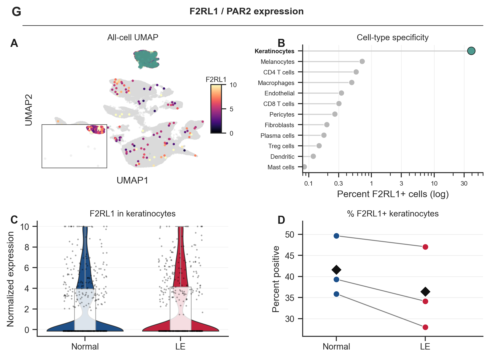

# lymphedema_keratinocyte_par2

[](LICENSE)
[](requirements.txt)

This repository contains the cohort definitions, rerun wrappers, curated
figures, summary tables, and notes for the keratinocyte `F2RL1 / PAR2`
analysis in paired normal and lymphedematous human skin. The shared
[`paired-single-cell-pipeline`](https://github.com/SecondBook5/paired-single-cell-pipeline) repository
provides the reusable `paired_sc` workflow, while this repository defines the
exact cohort, runtime configuration, and tracked deliverables for the
keratinocyte question.

It accompanies the single-cell analyses supporting *Critical Role of
Keratinocytes and PAR2 in Secondary Lymphedema Development* (Hyeung Ju Park,
Sarit Pal, Xizhao Chen, Jinyeon Shin, Gabriela D. Garcia Nores, Jung Eun Baik,
Annica Stull-Lane, Abraham J. Book, et al.; update citation details as
needed). Public sequencing data accession: GEO accession pending.

## Install And Run

Clone the repository and install its dependencies:

```bash
git clone https://github.com/SecondBook5/lymphedema_keratinocyte_par2.git
cd lymphedema_keratinocyte_par2
pip install -e ../paired-single-cell-pipeline
pip install -r requirements.txt
```

### Prerequisites

- Python 3.10
- a local checkout of
  [`paired-single-cell-pipeline`](https://github.com/SecondBook5/paired-single-cell-pipeline) installed
  into the same environment
- access to the 10x H5 files referenced by the cohort manifest

You can create an environment with either `environment.yml` or your preferred
Python environment manager.

### Typical Workflow

1. Build the runtime manifest and project config for the cohort you want to
   rerun. The default public alias is `manuscript_cohort`.

   ```bash
   python ./scripts/build_runtime_assets.py \
     --cohort manuscript_cohort \
     --matrix-root /path/to/h5_files \
     --validate
   ```

2. Run the shared core workflow against that runtime configuration.

   ```bash
   ./scripts/run_core_rerun.sh \
     --cohort manuscript_cohort \
     --matrix-root /path/to/h5_files
   ```

3. Regenerate the tracked keratinocyte/PAR2 figures, tables, and notes.

   ```bash
   ./scripts/regenerate_outputs.sh \
     --cohort manuscript_cohort
   ```

If you only need the paper figures, use the figure-specific entrypoints:

```bash
./scripts/figure_g.sh --cohort manuscript_cohort
./scripts/figure_s2.sh --cohort manuscript_cohort
```

Figure G also exposes panel-level scripts:

```bash
./scripts/figure_g_panel_a.sh --cohort manuscript_cohort
./scripts/figure_g_panel_b.sh --cohort manuscript_cohort
./scripts/figure_g_panel_c.sh --cohort manuscript_cohort
./scripts/figure_g_panel_d.sh --cohort manuscript_cohort
./scripts/figure_g_donor_table.sh --cohort manuscript_cohort
```

Supplementary figure entrypoints are available as well:

```bash
./scripts/figure_s2_panel_e.sh --cohort manuscript_cohort
./scripts/figure_s2_panel_f.sh --cohort manuscript_cohort
./scripts/figure_s2_panel_g.sh --cohort manuscript_cohort
./scripts/figure_s2_panel_h.sh --cohort manuscript_cohort
./scripts/figure_s2_state_overview.sh --cohort manuscript_cohort
./scripts/figure_s2_state_sensitivity.sh --cohort manuscript_cohort
./scripts/figure_s2_state_decomposition.sh --cohort manuscript_cohort
```

Runtime outputs are written under the ignored `work/` directory. Curated assets
at the repository root are refreshed in `figures/`, `tables/`, and `notes/`.

## Analysis Workflow

The rerun path is:

1. build a runtime `project.yaml` and `manifest.csv` for the selected cohort
2. run the shared `paired_sc` core workflow on those runtime assets
3. regenerate the keratinocyte-specific figures, tables, and notes from the
   resulting annotated object



## Start Here

If you only want the main deliverables:

- [figures/main_panel.png](./figures/main_panel.png)
- [figures/supplement.png](./figures/supplement.png)
- [figures/state_overview.png](./figures/state_overview.png)
- [figures/state_sensitivity.png](./figures/state_sensitivity.png)
- [figures/state_decomposition.png](./figures/state_decomposition.png)
- [tables/donor_summary.csv](./tables/donor_summary.csv)
- [tables/stats.csv](./tables/stats.csv)
- [notes/main_panel_caption.md](./notes/main_panel_caption.md)
- [notes/state_analysis_summary.md](./notes/state_analysis_summary.md)

Supporting documentation:

- [docs/quickstart.md](./docs/quickstart.md)
- [docs/reproducibility.md](./docs/reproducibility.md)
- [docs/asset_inventory.md](./docs/asset_inventory.md)

## Cohorts

Tracked cohort manifests live in [data/manifests](./data/manifests). Use the
manifest stem as the `--cohort` value. The public default is
`manuscript_cohort`; additional tracked cohort definitions are also preserved in
the same folder for comparison reruns.

## Repository Map

- [data/manifests](./data/manifests): release-safe cohort definitions
- [scripts](./scripts): runtime builders, bash rerun wrappers, and paper-figure
  entrypoints
- [figures](./figures): primary panels, supplements, state analyses, and
  composite exports
- [tables](./tables): donor-, sample-, condition-, and state-level summaries
- [notes](./notes): captions and short interpretation notes
- [docs](./docs): quickstart, reproducibility notes, and asset inventory

## Relationship To `paired_sc`

The shared `paired_sc` package provides the reusable workflow components:
matrix loading, QC, normalization, integration, annotation, and standardized
runtime outputs. This repository adds the keratinocyte-specific cohort
definitions, figure-generation scripts, and tracked deliverables used for the
PAR2 analysis. The package source lives in
[paired-single-cell-pipeline](https://github.com/SecondBook5/paired-single-cell-pipeline).

## Citation

If you use this repository, cite the associated keratinocyte/PAR2 manuscript
and the shared `paired_sc` core package. See
[CITATION.cff](./CITATION.cff).
