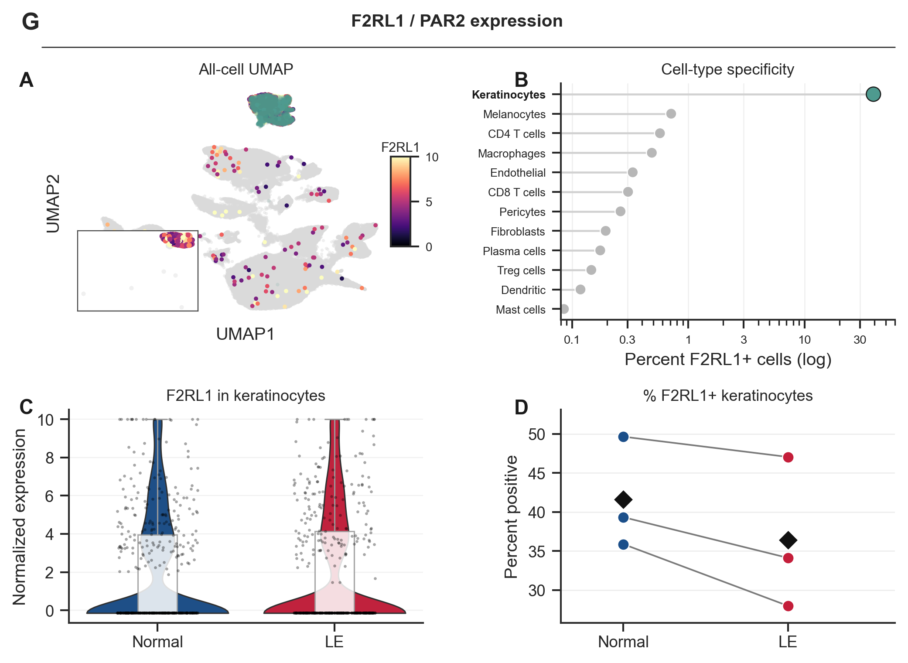

# lymphedema_keratinocyte_par2

[](LICENSE)
[](requirements.txt)
[](https://doi.org/10.1002/ctm2.70682)

This repository contains the cohort definitions, rerun wrappers, curated
figures, summary tables, and notes for the keratinocyte `F2RL1 / PAR2`
analysis in paired normal and lymphedematous human skin. The shared
[`paired-single-cell-pipeline`](https://github.com/SecondBook5/paired-single-cell-pipeline) repository
provides the reusable `paired_sc` workflow, while this repository defines the
exact cohort, runtime configuration, and tracked deliverables for the
keratinocyte question.

This repository accompanies the published Clinical and Translational Medicine
article:

> Park HJ, Pal S, Chen X, Shin J, García Nores GD, Baik JE, Stull-Lane A,
> Book AJ, Clement CC, Encarnacion EM, Klang MG, Riedel E, Chaunzwa TL,
> Hespe GE, Santambrogio L, Coriddi M, Dayan JH, Mehrara BJ, Kataru RP.
> **Critical role of keratinocytes and protease-activated receptor 2 in
> secondary lymphedema development.** *Clinical and Translational Medicine.*
> 2026;16(6):e70682. doi:
> [10.1002/ctm2.70682](https://doi.org/10.1002/ctm2.70682).

Raw sequencing matrices are not stored in this repository. Reruns require local
access to the 10x H5 files referenced by the cohort manifest and any additional
data-access instructions described in the published article.

## Install And Run

Clone the repository and install its dependencies:

```bash
git clone https://github.com/SecondBook5/lymphedema_keratinocyte_par2.git
cd lymphedema_keratinocyte_par2
pip install -e ../paired-single-cell-pipeline
pip install -r requirements.txt
```

### Prerequisites

- Python 3.10
- a local checkout of
  [`paired-single-cell-pipeline`](https://github.com/SecondBook5/paired-single-cell-pipeline) installed
  into the same environment
- access to the 10x H5 files referenced by the cohort manifest

You can create an environment with either `environment.yml` or your preferred
Python environment manager.

### Typical Workflow

1. Build the runtime manifest and project config for the cohort you want to
   rerun. The default public alias is `manuscript_cohort`.

   ```bash
   python ./scripts/build_runtime_assets.py \
     --cohort manuscript_cohort \
     --matrix-root /path/to/h5_files \
     --validate
   ```

2. Run the shared core workflow against that runtime configuration.

   ```bash
   ./scripts/run_core_rerun.sh \
     --cohort manuscript_cohort \
     --matrix-root /path/to/h5_files
   ```

3. Regenerate the tracked keratinocyte/PAR2 figures, tables, and notes.

   ```bash
   ./scripts/regenerate_outputs.sh \
     --cohort manuscript_cohort
   ```

If you only need the paper figures, use the figure-specific entrypoints:

```bash
./scripts/figure_g.sh --cohort manuscript_cohort
./scripts/figure_s2.sh --cohort manuscript_cohort
```

Figure G also exposes panel-level scripts:

```bash
./scripts/figure_g_panel_a.sh --cohort manuscript_cohort
./scripts/figure_g_panel_b.sh --cohort manuscript_cohort
./scripts/figure_g_panel_c.sh --cohort manuscript_cohort
./scripts/figure_g_panel_d.sh --cohort manuscript_cohort
./scripts/figure_g_donor_table.sh --cohort manuscript_cohort
```

Supplementary figure entrypoints are available as well:

```bash
./scripts/figure_s2_panel_e.sh --cohort manuscript_cohort
./scripts/figure_s2_panel_f.sh --cohort manuscript_cohort
./scripts/figure_s2_panel_g.sh --cohort manuscript_cohort
./scripts/figure_s2_panel_h.sh --cohort manuscript_cohort
./scripts/figure_s2_state_overview.sh --cohort manuscript_cohort
./scripts/figure_s2_state_sensitivity.sh --cohort manuscript_cohort
./scripts/figure_s2_state_decomposition.sh --cohort manuscript_cohort
```

Runtime outputs are written under the ignored `work/` directory. Curated assets
at the repository root are refreshed in `figures/`, `tables/`, and `notes/`.

## Analysis Workflow

The rerun path is:

1. build a runtime `project.yaml` and `manifest.csv` for the selected cohort
2. run the shared `paired_sc` core workflow on those runtime assets
3. regenerate the keratinocyte-specific figures, tables, and notes from the
   resulting annotated object



## Start Here

If you only want the main deliverables:

- [figures/main_panel.png](./figures/main_panel.png)
- [figures/supplement.png](./figures/supplement.png)
- [figures/state_overview.png](./figures/state_overview.png)
- [figures/state_sensitivity.png](./figures/state_sensitivity.png)
- [figures/state_decomposition.png](./figures/state_decomposition.png)
- [tables/donor_summary.csv](./tables/donor_summary.csv)
- [tables/stats.csv](./tables/stats.csv)
- [notes/main_panel_caption.md](./notes/main_panel_caption.md)
- [notes/state_analysis_summary.md](./notes/state_analysis_summary.md)

Supporting documentation:

- [docs/quickstart.md](./docs/quickstart.md)
- [docs/reproducibility.md](./docs/reproducibility.md)
- [docs/asset_inventory.md](./docs/asset_inventory.md)

## Cohorts

Tracked cohort manifests live in [data/manifests](./data/manifests). Use the
manifest stem as the `--cohort` value. The public default is
`manuscript_cohort`; additional tracked cohort definitions are also preserved in
the same folder for comparison reruns.

## Repository Map

- [data/manifests](./data/manifests): release-safe cohort definitions
- [scripts](./scripts): runtime builders, bash rerun wrappers, and paper-figure
  entrypoints
- [figures](./figures): primary panels, supplements, state analyses, and
  composite exports
- [tables](./tables): donor-, sample-, condition-, and state-level summaries
- [notes](./notes): captions and short interpretation notes
- [docs](./docs): quickstart, reproducibility notes, and asset inventory

## Relationship To `paired_sc`

The shared `paired_sc` package provides the reusable workflow components:
matrix loading, QC, normalization, integration, annotation, and standardized
runtime outputs. This repository adds the keratinocyte-specific cohort
definitions, figure-generation scripts, and tracked deliverables used for the
PAR2 analysis. The package source lives in
[paired-single-cell-pipeline](https://github.com/SecondBook5/paired-single-cell-pipeline).

## Citation

If you use this repository, cite both the published keratinocyte/PAR2 paper and
the shared `paired_sc` core package.

```bibtex
@article{park_critical_role_keratinocytes_2026,
  author = {Park, Hyeung Ju and Pal, Sarit and Chen, Xizhao and Shin, Jinyeon and García Nores, Gabriela D. and Baik, Jung Eun and Stull-Lane, Annica and Book, Abraham J. and Clement, Cristina C. and Encarnacion, Elizabeth M. and Klang, Mark G. and Riedel, Elyn and Chaunzwa, Tafadzwa L. and Hespe, Geoffrey E. and Santambrogio, Laura and Coriddi, Michelle and Dayan, Joseph H. and Mehrara, Babak J. and Kataru, Raghu P.},
  title = {Critical role of keratinocytes and protease-activated receptor 2 in secondary lymphedema development},
  journal = {Clinical and Translational Medicine},
  year = {2026},
  volume = {16},
  number = {6},
  pages = {e70682},
  doi = {10.1002/ctm2.70682},
  url = {https://onlinelibrary.wiley.com/doi/10.1002/ctm2.70682}
}
```

See [CITATION.cff](./CITATION.cff) for machine-readable citation metadata.
